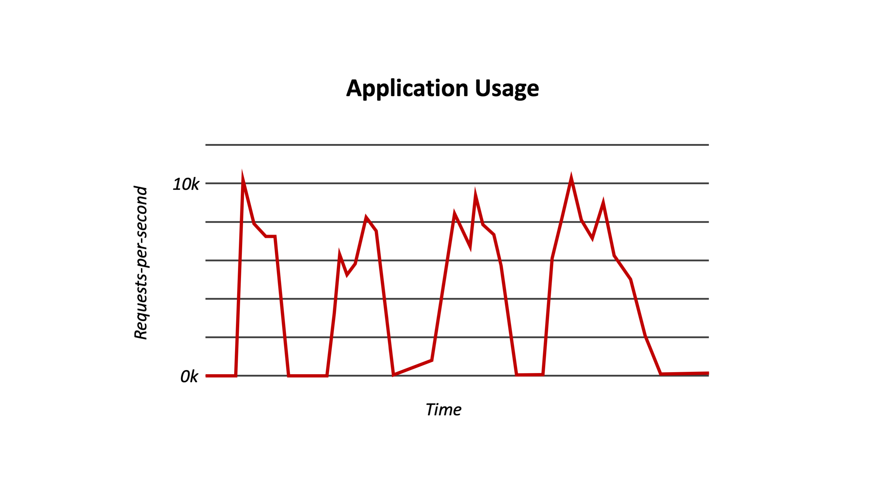

<!--
#
# Licensed to the Apache Software Foundation (ASF) under one or more
# contributor license agreements.  See the NOTICE file distributed with
# this work for additional information regarding copyright ownership.
# The ASF licenses this file to You under the Apache License, Version 2.0
# (the "License"); you may not use this file except in compliance with
# the License.  You may obtain a copy of the License at
#
#     http://www.apache.org/licenses/LICENSE-2.0
#
# Unless required by applicable law or agreed to in writing, software
# distributed under the License is distributed on an "AS IS" BASIS,
# WITHOUT WARRANTIES OR CONDITIONS OF ANY KIND, either express or implied.
# See the License for the specific language governing permissions and
# limitations under the License.
#
-->

# Review: What is Serverless?

1. What characteristics of Serverless computing contribute to its name?
[ ] Developers can run backend code to access databases without using servers.
[x] Serverless computing scales inherently to incoming events.
[ ] Serverless computing does not use servers.
[x] Server management decisions are hidden from the developer.
[ ] Serverless developers only need to configure the service framework for their chosen language.

Note: Make sure you select all of the correct options—there may be more than one!

[explanation]
Serverless computing uses servers to execute functional code in response to events. Developers do not need to setup, configure or manage servers or language-specific service frameworks in order to develop or run their functions.  In addition, the Serverless platform handles all aspects of management and operations including scaling, monitoring, logging and security.
[explanation]

---

2. Serverless computing is a specific technology with a developed set of standards and practices.
(!) True
(x) False

[explanation]
Serverless computing still a cutting-edge Cloud technology that is implemented differently by different Serverless providers. Different providers may use different paradigms to run and scale your functional code.  There is no standardized API, no standardized packaging mechanism not Also, you will find that the arguments, environment .  It is always best to look for Serverless solution providers who are working with others in proven open source organizations and projects to promote Serverless maturity and standards.
[explanation]

---

3. Serverless computing requires the developer to allocate servers and machine resources.
(!) true
(X) false

[explanation]
[explanation]

---

4. Serverless computing scales inherently and executes stateless code in response to events.
(!) false
(x) true

[explanation]
[explanation]

---

5. Isabelle decided to use serverless computing for a project that crops photos automatically when added to cloud storage. How would you judge her choice?

(!) Serverless is a great choice here because it allows Isabelle to manage the allocation of machine resources.
( ) Serverless won’t work well here because it depends too much on how often customers will be uploading photos.
(x) Serverless may work well, but Isabelle will have to spend some time configuring servers to handle the infrequent uploads.
(X) Serverless is a great choice because it can flexibly react to incoming photos and crop them as needed.

[explanation]
[explanation]

---

6. You need to develop a project that is as cost-effective as possible. For which reasons would you pick serverless?

[X] Serverless outsourcing leads to less infrastructure, operational, and development costs.
[x] Serverless only charges for time when code is executing.
[ ] Serverless applications can run in low-cost, pre-allocated capacity you can purchase in advance.

Note: Make sure you select all of the correct options—there may be more than one!

[explanation]
With Serverless, you only pay for compute costs that your functions use on a per-invocation basis (i.e., "Pay-as-you-go").  The Serverless providers worry about all the Infrastructure and DevOps while all your developers worry about is writing functional business logic. There is no need to pay for pre-allocated capacity as the provider will scale your functions as needed each receiving the compute and memory limits that you are guaranteed by your license agreements.
[explanation]

---

7. Long running and non-separable tasks are types of tasks that typically work well in a serverless environment.

(x) false
( ) true

[explanation]
[explanation]

---

8. Serverless scales automatically by running code only in response to event triggers.

( ) incorrect
(x) correct

---

9. You are given the following graph of usage for an application you are developing. Which of the following is a correct conclusion of the graph?

<!-- Application Usage Graph</img> -->

( ) The usage is mostly constant, so serverless computing would be a good fit for this usage case.
(x) The usage is mostly sporadic, so serverless computing is a good fit for this usage case.
( ) The usage is mostly constant, so serverless computing would be a bad fit for this usage case.
( ) The usage is mostly sporadic, so serverless computing is a bad fit for this usage case.
