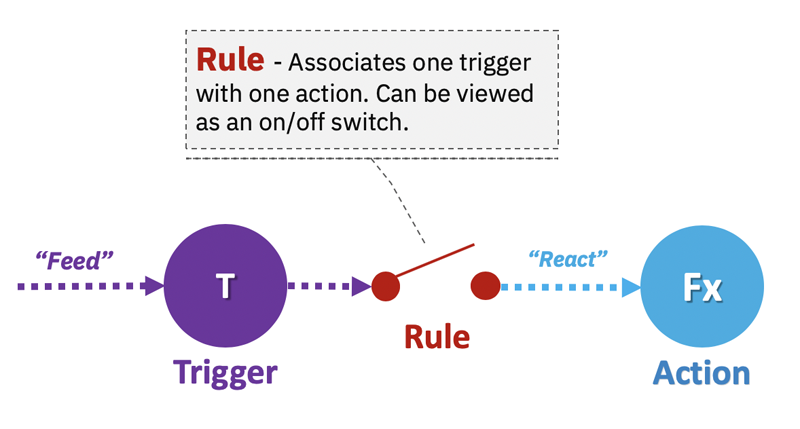
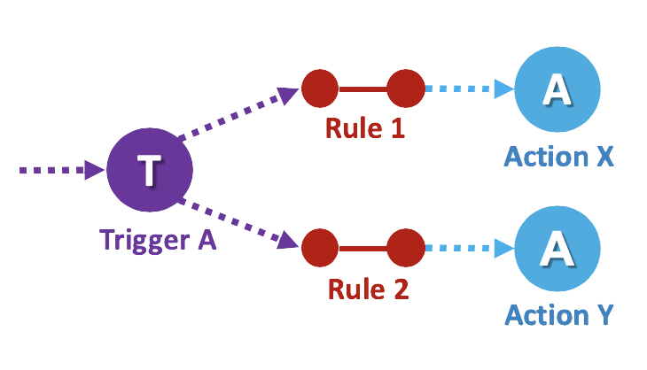

<!--
#
# Licensed to the Apache Software Foundation (ASF) under one or more
# contributor license agreements.  See the NOTICE file distributed with
# this work for additional information regarding copyright ownership.
# The ASF licenses this file to You under the Apache License, Version 2.0
# (the "License"); you may not use this file except in compliance with
# the License.  You may obtain a copy of the License at
#
#     http://www.apache.org/licenses/LICENSE-2.0
#
# Unless required by applicable law or agreed to in writing, software
# distributed under the License is distributed on an "AS IS" BASIS,
# WITHOUT WARRANTIES OR CONDITIONS OF ANY KIND, either express or implied.
# See the License for the specific language governing permissions and
# limitations under the License.
#
-->

# The serverless programming model

## A least common denominator (LCD) view

There is no singular open standard for the serverless programming model,  deployment model, or, as a consequence, its APIs. Different providers may use different, but similar, semantics to describe the component parts that play a role in taking an event and causing a serverless function to execute.

Shown below is a basic view of how serverless works using the most common semantics from the serverless domain which is also applicable to IBM Cloud Functions (ICF).

## It all starts with an event

Regardless of implementation or who you discuss serverless with, it’s all about invoking a function based upon an associated event and the data it’s designed to operate on.

## Events originate from an Event Source

Events that can be associated with functions always come from real-world or originating sources. In a serverless programming model, the **Event Source** can be conceptual or represent an adapter service that understands how to receive raw event data from the originator. This can then be turned into data that a function can process.

Event sources can represent entities that produce event data from manual or automated originating events. These may include manual and automated sources.

#### Manual sources

Manual sources are either:

- **Directly** from a user calling a front-end API (public or private) with data.
- **Indirectly** from a user interacting with a website that uses serverless to generate web content.

#### Automated sources

Automated sources include:

- Periodic alarm events to process data on a schedule, or batch jobs
- Change data storage devices like SQL databases and S3 Cloud Object Storage
- Received messages on a message queue like Kafka and Rabbit MQ
- Email messages
- Mobile push notifications
- IoT sensor data, including vehicle performance data and weather data


The conceptual list of automated sources that can be processed by serverless functions is endless!


## The Feed is the event adapter

In the case of the ICF's model, the event source is more conceptual and the **Feed** represents an adapter service in the system. The feed understands how to connect to and/or receive data from an event source, adapt it to a normalized form, and then feed it to one or more functions by invoking triggers. Feeds follow one of three patterns:

1. _Hook_: A feed uses a webhook facility or callback mechanism exposed by an external service that generates events like an event source.

2. _Polling_: A service that polls an external service endpoint periodically to fetch new data and generate its own events.

3. _Connection_: A dedicated running service that maintains a persistent connection to an event source (for example, implementing a client of a message queue service or database) that creates and generates events on its behalf.

Feeds that are implemented as long-running services are sometimes referenced as event provider services.


Later in the course, you will learn how to implement a **polling feed service** using a serverless function that is periodically triggered from an  alarm!


## Why does ICF use triggers?

**Triggers** are not part of every serverless programming model but are a powerful concept within ICF that supports the [observer design pattern](https://en.wikipedia.org/wiki/Observer_pattern) effectively.

In ICF, the trigger is a programmatic construct that represents a class of or stream of events that are suitable for one or more associated functions to process. In this pattern, the functions themselves are the _observers_ or event "sinks" for the event data. This loose association allows both the functions and the event sources to remain independent and agnostic to any specific underlying event processing implementations.


The term trigger in the model is intended to draw upon the analogy of triggering or firing a weapon; therefore, you may encounter these terminologies instead of terms like invoking or calling a function.


## Why call a function an Action?

Within the ICF programming model, the **Action** represents more than just the actual functional code that gets executed. It also represents the metadata associated with the function itself which includes:

- **Name and namespace**: These are logical names used to uniquely reference the action within ICF and apply access control.
- **Description**: An (optional) explanation of the function purpose and usage.
- **Runtime**: Runtime includes the language, runtime type, and version.
- **Versioning**: The internal version is tracked as the code changes over time.
- **Parameter declarations**: This includes input and output type data and descriptions.
- **Parameter defaults**: This is the default values applied when they are missing from the event data.
- **Limits**: Limits can be optional for an action timeout, memory, and log size which is constrained by ICF maximums.
- **Annotations**: An associated system and user appended metadata.
    - Advanced deployment tooling even utilizes annotations to enable auto-managing client-server synchronization of packages, actions, triggers, rules and other data via hashing techniques.

As you proceed through this course using ICF, you will use the term action more often than the word function. Know that this course primarily references the function which is central to the action.

## The last piece of the model is the Rule

In order for a successful design of the observer pattern described above, you need to introduce one last logical component to the programming model. That is called the **Rule**.

Rules are used to associate one trigger with one action. After this kind of association is created, each time a trigger event is fired, the action is invoked. Think of them as an on/off switch that enables or disables trigger events reaching an action.

With an appropriate set of rules, a single trigger event can invoke multiple actions. Events from multiple triggers can invoke the same action.

| 1 Trigger, 2 Actions | 2 Triggers, 1 Action |
:-------------------------:|:-------------------------:
|  | |


As you can see, the ICF programming model has been well thought out and has led to a robust and powerful implementation of serverless that you will soon experience first-hand!

