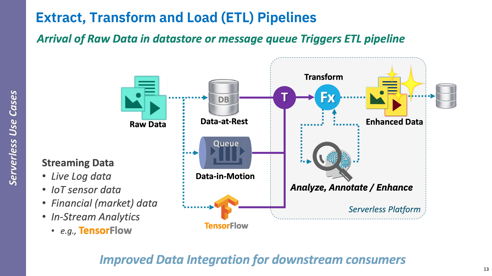
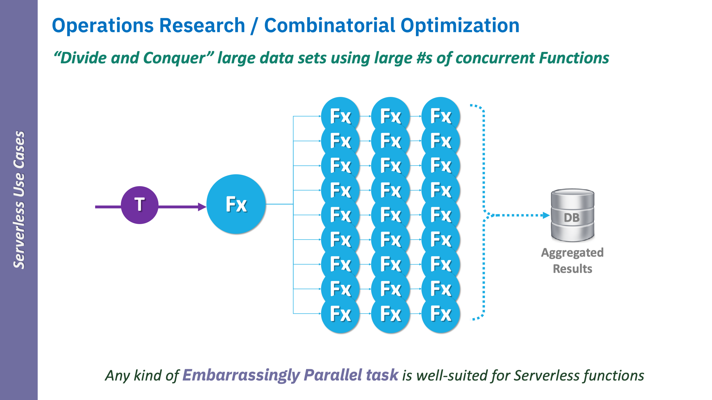

<!--
#
# Licensed to the Apache Software Foundation (ASF) under one or more
# contributor license agreements.  See the NOTICE file distributed with
# this work for additional information regarding copyright ownership.
# The ASF licenses this file to You under the Apache License, Version 2.0
# (the "License"); you may not use this file except in compliance with
# the License.  You may obtain a copy of the License at
#
#     http://www.apache.org/licenses/LICENSE-2.0
#
# Unless required by applicable law or agreed to in writing, software
# distributed under the License is distributed on an "AS IS" BASIS,
# WITHOUT WARRANTIES OR CONDITIONS OF ANY KIND, either express or implied.
# See the License for the specific language governing permissions and
# limitations under the License.
#
-->

# When to apply Serverless

## Serverless as the ultimate Microservice framework

If you have already moved towards deconstructing your monolithic applications to embrace microservices and reactive programming concepts, then Serverless should be viewed as the ultimate programming evolution towards realizing and optimizing these concepts as a computing service in a language-agnostic way.

### General patterns for Serverless

#### **Unpredictable load**

This means loads that are _aperiodic in nature_, that is, the number of requests to (or usage of) the functional service varies widely and unpredictably over time.

#### **Infrequent load**

Some functional service usage may well be more _periodic or predictable in nature_, yet be called only at certain scheduled times or when enough data has been accumulated.


Most user-driven use cases, including data driven by workflows with human interactions, fall under these patterns.  Almost any functional services not under constant load could qualify as Serverless candidates.



Hosting these cases as Serverless functions on IBM Cloud Functions can be extremely cost-effective for both its [PAYGO](https://en.wikipedia.org/wiki/PAYGO) cost model and its ability to automatically scale on-demand.


### Serverless Anti-patterns

#### **Functions under constant load**

Although IBM Cloud Functions can scale and keep up with large demands on Serverless functions; each functions is single use and therefore suffers "cold start" load times.

Cold start time includes starting a language runtime compatible with your function, as well as loading your function and starting it.

#### Long-running or non-separable tasks

For example:

- **Functions with lots of dependencies**

    If you are thinking of Serverless, then hopefully you are not trying to bring over large, monolithic application "chunks" and treat them as "functions".

    However, if you do have large functional services "cold start" times, as described above, are a primary consideration.  That is, some functions may have dependencies on frameworks, runtime libraries and other dependencies all of which must load on each request negating Serverless benefits.

- **Network intensive functions**

    Your PAYGO costs will go up if functions are waiting on (external) services to respond since you are paying for that idle time. Network timeouts are also a consideration when evaluating potential wait costs.


Please note that there are ways to recognize and mitigate against these anti-patterns, primarily using the same strategies used for event-driven microservices, which we will cover in more advanced courses.


## "Top 4" Serverless use cases

Although you can use Serverless to solve most problems, here are four general use cases Developers looking adopting Serverless should consider.

### 1. Alarm driven (periodic)

One if the best patterns to look for when adopting Serverless is that `"Alarm"` pattern, that is IBM Cloud Functions provides a built-in service that can trigger your Actions on a schedule you configure.

This kind of use case is often referred to as a `"batch job"`, as you accumulate data in some data storage service and process it in a "batch".

Alternatively, it can also be called a `"cron job"` as for the [popular Linux utility](https://en.wikipedia.org/wiki/Cron) used as a job scheduler.  In fact, the ICF Alarm supports a standardized cron format just like that utility which supports:

- **Periodic Intervals** - every X secs/mins
  - _Batch process orders every 24 hours at 12 PM_
- **Time Windows** - Start / Stop by Date-Time
  - _Accept lunch orders Mon-Fri at 11AM Stop accepting at 2PM_
- **Specific date/time** - “fire once”, or recurring
  - _Launch a new website on Jan. 1st 2021_

As you can infer, the pattern typically relies upon functional access to external data storage (e.g., Cloud Object Storage (COS) or Cloudant) where the data is "batched up".


In this course, we will actually show you how to setup the Alarm feed provider in ICF to schedule the triggering of your functions!


If you want to read more about ICF Alarms check out this blog:
- _[New Alarm based trigger events for IBM Cloud Functions](https://www.ibm.com/cloud/blog/new-alarm-based-trigger-events-for-ibm-cloud-functions)_

### 2. Extract-Transform-Load (ETL) Pipelines

Anytime you have data that may be raw, unstructured or needs to be prepared or enhanced in some way for downstream applications and workflows to consume, Serverless is for you.

Serverless frameworks such as IBM Cloud Functions, typically have ready-made feeds to allow you to access data, regardless if its "state", to perform your needed transformations and enhancements on including:

#### _Data-at-Rest_

Configure a feed to receive events whenever data changes occur in the database.

- **Structured**:
  - [SQL / Relational](https://www.ibm.com/cloud/learn/relational-databases) _(e.g., DB2, MySQL, Postgres, etc.)_
- **Unstructured**:
  - [NoSQL](https://www.ibm.com/cloud/learn/nosql-databases) _(e.g., [Cloudant](https://www.ibm.com/cloud/cloudant), CouchDB, Redis)_

<!--

Check our [IBM Cloud databases](https://www.ibm.com/cloud/databases) for more sources.

-->

#### _Data-in-Motion_

Configure a client feed to "pull" messages off a queue and trigger an action with the message data.

- Message Queues _(e.g., Kafka, RabbitMQ)_

#### _Streaming Data (Analytics)_

Yes, you can absolutely use Serverless functions to transform/enhance data "in stream"!

- Live Log data
- IoT sensor data
- Financial (market) data
- In-Stream Analytics (e.g., _[TensorFlow](https://www.tensorflow.org/))_
  <!-- -  -->


Consider using the `Alarm` pattern along with ETL pipelines when working with "data-at-rest".


### 3. Serverless APIs

If you provide customer or internal facing API,  especially those that are not under a high, constant load, creating an API endpoint that is backed by a Serverless function **should be your choice 100% of the time**.

In fact, IBM Cloud Functions includes API Gateway integration that allows you to create secure APIs and even publish them using the [OpenAPI Specification](https://www.openapis.org/) also known as _"Swagger"_.

### 4. "Divide & Conquer" / Map Reduce

Serverless opens the door to performing high-end analytics and problem solving that was previously only for available using expensive services using  pre-allocated server clusters.

Serverless offers a low cost alternative to run what are often called _**Embarrassingly Parallel Tasks**_ often needed for Divide & Conquer styled processing steps. These include:

- **Map Reduce operations**
- **Monte-Carlo simulations**
- **Evolutionary Algorithms (EA)**
- **Genetic Algorithms (GA)**
- **Hyperparameter tuning**
- **Web scraping**

Serverless Providers are constantly competing to give each function large amounts of concurrent execution with guaranteed memory and execution time in order to perform such tasks.


Analytic workloads are one of the fastest growing use cases for Serverless especially using the Python language.  IBM has created the [PyWren project](https://github.com/pywren/pywren-ibm-cloud) to provide libraries and examples that help you quickly build analytic application by integrating data from open source projects like [Jupyter](https://jupyter.org/) and [TensorFlow](https://www.tensorflow.org/).


If you want to see a tutorial that uses ICF for Deep learning, you may read [Leverage deep learning in IBM Cloud Functions](https://developer.ibm.com/technologies/artificial-intelligence/tutorials/leverage-deep-learning-in-apache-openwhisk-ibm-cloud-functions/).


Hopefully, you are getting excited about applying some of these use cases to your favorite applications!
