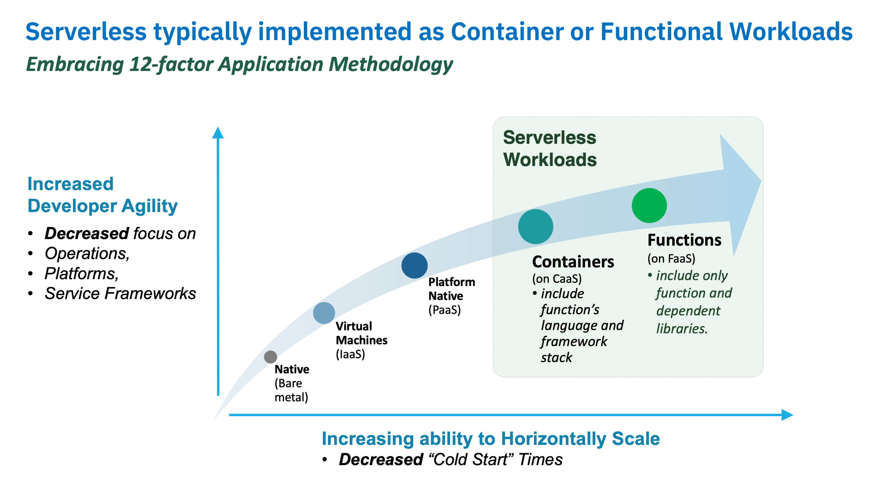

<!--
#
# Licensed to the Apache Software Foundation (ASF) under one or more
# contributor license agreements.  See the NOTICE file distributed with
# this work for additional information regarding copyright ownership.
# The ASF licenses this file to You under the Apache License, Version 2.0
# (the "License"); you may not use this file except in compliance with
# the License.  You may obtain a copy of the License at
#
#     http://www.apache.org/licenses/LICENSE-2.0
#
# Unless required by applicable law or agreed to in writing, software
# distributed under the License is distributed on an "AS IS" BASIS,
# WITHOUT WARRANTIES OR CONDITIONS OF ANY KIND, either express or implied.
# See the License for the specific language governing permissions and
# limitations under the License.
#
-->

# Serverless deployment models

## Functions versus containers

Serverless platforms typically support the management and deployment of serverless functions either using:

- **Functions directly** where the:
  - Provider uses an orchestration system optimized for a Function-as-a-Service (FaaS).
  - Functions are loaded and run on pre-configured, language-specific runtimes.
  
- **Pre-packaged containers** where the:
  - Provider uses Container-as-a-Service (CaaS) container-orchestration platforms like [Kubernetes](https://kubernetes.io/) and treats them as single-function applications.
  - Developer must package functions within containers, along with any necessary language dependencies. This requires a service framework that can handle HTTP network requests, invoke the functions, and return responses.

## Packaging for serverless FaaS

In general, with a FaaS serverless implementation, you need only to submit a single function and any dependencies (for example, packages or libraries) that are not already built into the language runtime the serverless provider prepares. This packaging step usually involves creating an archive format like ZIP or JAR (Java).

In these cases, the serverless provider usually has ready-made containers that contain system and language libraries for languages such as JavaScript (Node.js), Python, Java, and perhaps other useful libraries. These other libraries may support, for example, data transformations, network access, and connections to databases and message queues.

#### Typical packaging steps

1. Write your function in a language that the FaaS platform supports.
1. Select the target language runtime and version. You need to also find out what additional libraries it may already include.
1. If needed, create an archive with a function and any additional libraries not supported by the runtime.
1. Submit the function or archive it to a FaaS platform with a selected runtime identifier. This is typically done through a supported API client.

## Packaging for serverless CaaS

With a serverless platform that is designed for containers, you must select a base container and build your own microservice stack to host and run your function. This typically involves selecting a base runtime container for your language and version. Then, you select and install a service framework that can support HTTP network connections. Next, you install your function and dependent application libraries into that service framework. Finally, you export that function on an endpoint (route) that is compatible with the serverless platform.

#### Additional responsibilities for CaaS functions

With the CaaS approach, other operational responsibilities now become the responsibility of the developer preparing the container. You are responsible for the overall container security and maintaining the versions of not only the base container, but also of their chosen service framework. You also need to be aware of any supporting libraries. In addition, plans may have to be made to support capturing function-level logs and metrics which normally would be transparent with a FaaS approach.

#### Typical packaging steps

1. Write your function and plan to host it using a language-specific service framework.
1. Select a base image from a repository with the language runtime version you desire. If you are able to, select one that may have your service framework already installed.
1. Build your function, any supporting libraries needed, and service framework if it’s not already included in the image.
1. Export your FaaS endpoint from your framework and configure the framework as needed to export logs and metrics.
1. Submit the resultant image to the CaaS serverless platform. This could be a direct submission or indirect from a supported image repository.


ICF is a FaaS which runs functions fast, but also gives you the option to "bring your own container" using a Docker SDK. This feature allows you to create Docker containers optimized for any language with only the libraries and versions you need while exploring a FaaS!



Congratulations! Now you understand the general methods serverless providers use to manage and scale functions with FaaS or CaaS! Learn more about [Preparing apps for actions](https://cloud.ibm.com/docs/openwhisk?topic=cloud-functions-prep) in ICF.

