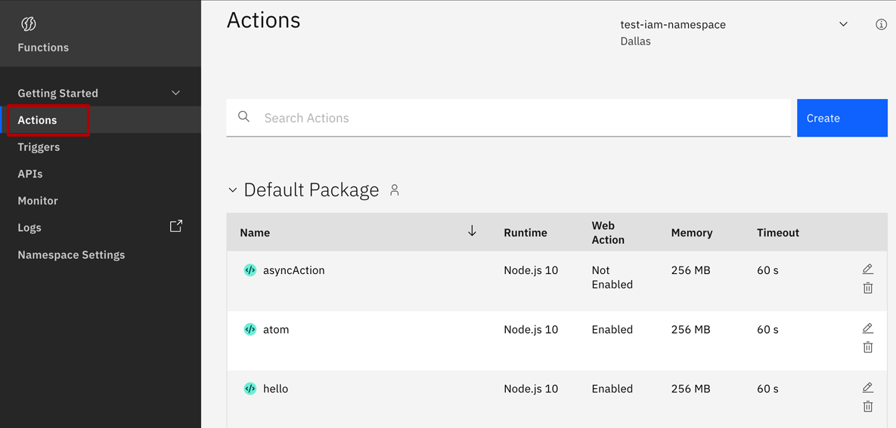
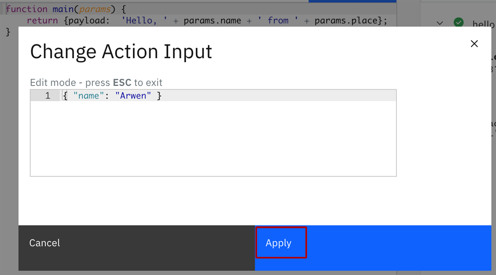
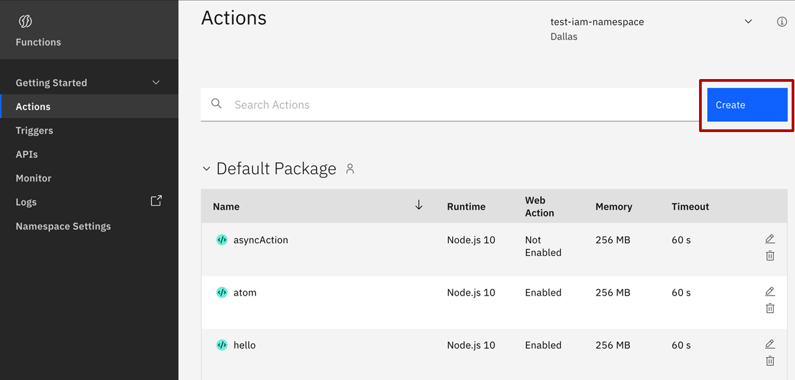
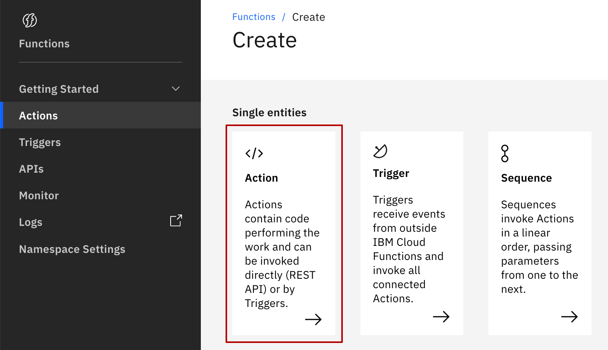
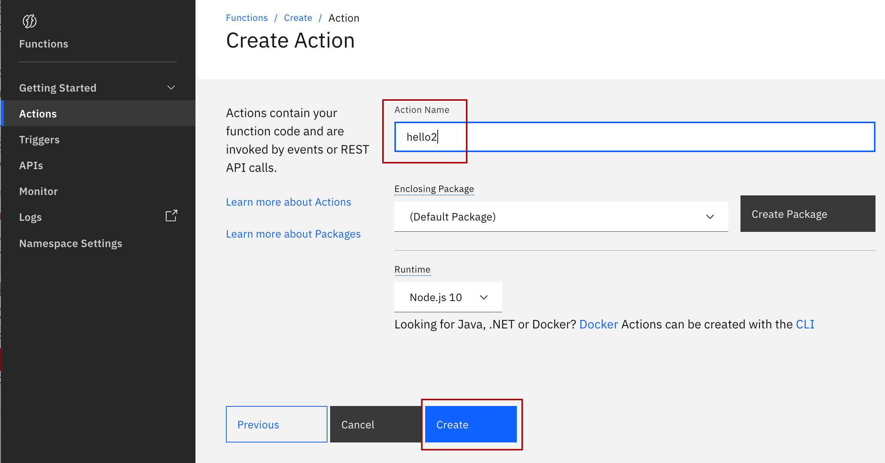

# Managing actions

## List actions for a namespace and region

1. Select "Actions" from the left-hand menu panel on the IBM Cloud **Functions** homepage which will display the [Management page for actions](https://cloud.ibm.com/functions/actions). It shows actions created within the selected IBM Cloud namespace and region.

The following screenshot shows a listing of actions created in the `test-iam-namespace` namespace in the `Dallas` region:

2. Click on the name of the `hello` action to move to the action details page.

## Details overview

The action details page shows properties for the chosen action.

For actions written in a supported language runtime, a source code editor with the action code is displayed. It allows users to make live changes and publish them making them immediately available to users.

Using the menu on the left-hand side, different properties for the action can be accessed and modified:

* **Code** shows action source code in editor.
* **Parameters** shows default parameters for the action.
* **Runtime** shows the action runtime, timeout value, and memory limit.
* **Endpoints** allow you to enable the action as a web action, and/or raw HTTP action and shows its HTTP endpoint.
* **Connected triggers** shows the triggers the action is connected to.
* **Enclosing sequences** shows sequences which use this action.

You can explore these options later at your convenience.

## Invoke actions

Let's see what happens when we invoke the selected action from the details page.

1. Click the "Invoke" button to invoke the action and display the resulting activation record.

2. Click the "Invoke with parameters" button.

3. Update JSON object with the `name` input parameter and click "Apply".

4. Click "Invoke" again.

What do you see in the `results` of the activation record for this invocation?

## Create new action

1. Return to the [action listing page](https://cloud.ibm.com/functions/actions) using the breadcrumb in the top-left of the page.

2. Select the "Create" button from the page.

3. click on "Action" from the "Create" entity list.

4. Fill in the `hello2` for the "Action name".

The "Runtime" dropdown should already be defaulted to the latest Node.js runtime version.

5. Click "Create".

You should now see your `hello2` action indthe action details page. By default, all new actions in the web UI are pre-filled with a "hello world" function for the chosen language runtime:

from here you can modify the source code to have any function you like!


Well done! You now can fully use the web UI to create and manage new actions as you did in the CLI.

