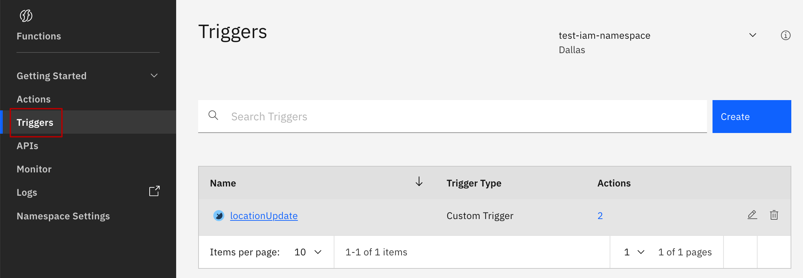
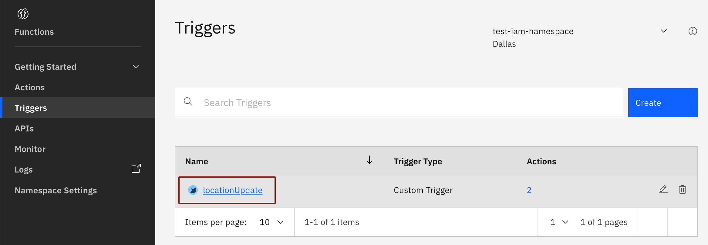

# Managing triggers

## List triggers for a namespace and region

1. Select "Triggers" from the left-hand menu panel on the **Functions** homepage which will display the [management page for triggers](https://cloud.ibm.com/functions/triggers). It shows triggers created within the selected IBM Cloud namespace and region.

The following screenshot shows a listing of triggers created in the `test-iam-namespace` namespace in the `Dallas` region:

2. Click on the name of the `locationUpdate` trigger to move to the trigger details page.

## Details overview

The trigger details page shows properties for the chosen trigger.

In this case, we see that the `locationUpdate` trigger is connected to two actions using the two rules we created earlier.

Using the menu on the left-hand side, different properties for the trigger can be accessed and modified:

* **Connected actions**  shows the actions this trigger is connected to.
* **Parameters** shows default parameters for the action.
* **Endpoints** show details on how to fire this trigger remotely.

You can explore these options later at your convenience.

## Create triggers

From the [trigger create page](https://cloud.ibm.com/functions/triggers), new triggers can be created.

1. Select the "Create" button from the page.

2. Choose "Create Trigger" from the list.

3. Choose "Trigger type" as "Custom Trigger"

4. Fill in "Trigger Name" and "Description"
5. Click "Create"


When you connect a trigger to an action, the underlying code of the web UI automatically creates a **rule** "under the covers" which is enabled by default. You can disable the rule for any action by selecting "connected actions" from the trigger details page.

